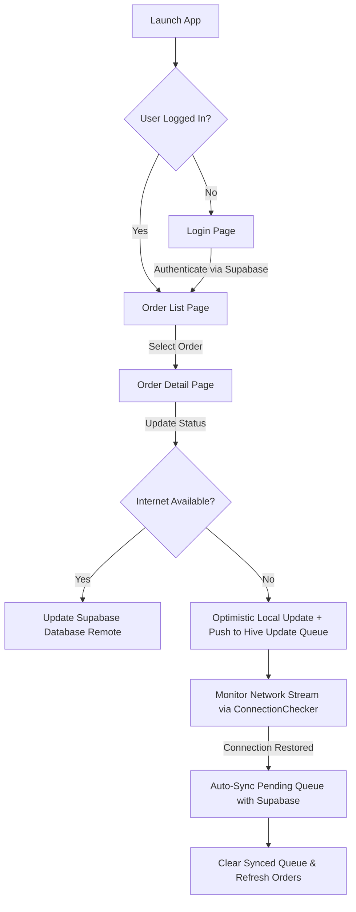

# Order Tracker App

An offline-first Flutter application designed for managing and tracking customer order statuses seamlessly across online and offline states.

# AUTHENTICATION CREDENTIALS

LOGIN EMAIL: admin@example.com
LOGIN PASSWORD: 12345678

---

## 📱 Features

- **Authentication Flow**: User login and session persistence.
- **Order Tracking**: List orders, view order summary, items, and total pricing.
- **Instant Search**: Search orders offline by customer name, order number, or status.
- **Optimistic UI Updates**: Status changes reflect immediately in the application interface.
- **Offline Update Queue & Auto-Sync**: Order status changes made offline are saved locally in a persistent queue (`Hive`) and automatically synchronized with the backend (`Supabase`) as soon as internet connectivity returns.
- **Automated Unit Testing**: Comprehensive test suite ensuring models, controllers, and offline storage work reliably.

---

## ⚙️ State Management Architecture

This application utilizes **GetX** as its primary state management, dependency injection, and navigation framework.

### Why GetX?
1. **Decoupled Business Logic**: Logic is encapsulated inside `GetxController` classes (`OrderController`, `ProfileController`), separating UI views from business logic and remote data fetching.
2. **Explicit State Updates**: `GetBuilder` is paired with `update()` calls in controllers to rebuild only relevant UI components efficiently.
3. **Dependency Injection**: Dependencies are injected globally at app startup via `Get.put<Controller>()`, making services and controllers easily accessible (`Get.find<OrderController>()`).
4. **Navigation & Feedback**: Navigation and user notification snackbars are decoupled from build contexts (`Get.offUntil()`, `Get.snackbar()`).

---

## 🔄 Application Workflow



### Workflow Summary:
1. **Authentication Flow**:
   - The user inputs credentials on `LoginPage`.
   - `ProfileController` validates credentials via `ProfileData` (Supabase `profiles` table).
   - Upon successful login, user session is stored using `SharedPrefsService` and the user is routed to `OrderListPage`.

2. **Order Management & Filtering**:
   - `OrderController` fetches all orders from Supabase when connected and caches them in Hive local storage (`orders` box).
   - When offline, orders are loaded directly from local Hive cache.
   - Users can search orders using `searchOrders()`, which filters results locally by customer name, order number, or status string.

3. **Status Updates & Offline Queue Sync**:
   - When a user changes an order status on `OrderDetailPage`:
     - The status is updated **optimistically** in local memory and saved to Hive.
     - **Connected State**: The update is sent to Supabase immediately (`updateOrderStatusApi`).
     - **Offline State**: The change is added to the persistent `update_queue` Hive box and a notification informs the user that changes are queued.
   - `ConnectionChecker` periodically monitors internet connectivity and exposes a broadcast `connectionStream`.
   - When connectivity switches to `true`, `OrderController` automatically triggers `syncPendingUpdates()`:
     1. Iterates through all queued items in `update_queue`.
     2. Pushes status updates to Supabase remote database.
     3. Removes successfully synced items from `update_queue`.
     4. Displays a completion snackbar and refreshes the remote order list.

---

## 📦 Packages Used & Purpose

| Package | Purpose |
| :--- | :--- |
| **`get`** | State management (`GetxController`, `GetBuilder`), dependency injection (`Get.put`, `Get.find`), and route/snackbar management. |
| **`supabase_flutter`** | Backend service integration for database operations (`orders`, `profiles`) and authentication. |
| **`hive` & `hive_flutter`** | Lightweight, high-performance NoSQL local key-value store for caching orders, profile details, and pending offline updates (`update_queue`). |
| **`shared_preferences`** | Persistent local key-value storage for user session state. |
| **`flutter_screenutil`** | Adapts UI element dimensions and font sizes across different screen resolutions. |
| **`intl`** | Formatting dates (`DateFormat`) and currency figures. |
| **`path_provider`** | Provides filesystem directory locations for Hive database storage on target devices. |
| **`cupertino_icons`** | iOS-style iconography. |

---

## 🧪 Unit Testing

The repository contains a unit test suite covering:
- **`test/order_model_test.dart`**: JSON parsing, serialization, and `copyWith` functionality for `OrderModel` and `OrderItemModel`.
- **`test/local_storage_service_test.dart`**: Hive local order saving/retrieval and `update_queue` operations (saving, getting, removing, clearing updates).
- **`test/order_controller_test.dart`**: Order fetching, local search filtering, status enum updates, optimistic UI modifications, and offline update queuing logic.
- **`test/profile_controller_test.dart`**: Password obscure toggle and login/logout state management.
- **`test/widget_test.dart`**: Basic app smoke test.

### WHERE USED AI:

For testcase creation and testing and for creating readme data I used AI tool.

### Running Tests:
```bash
flutter test
```
